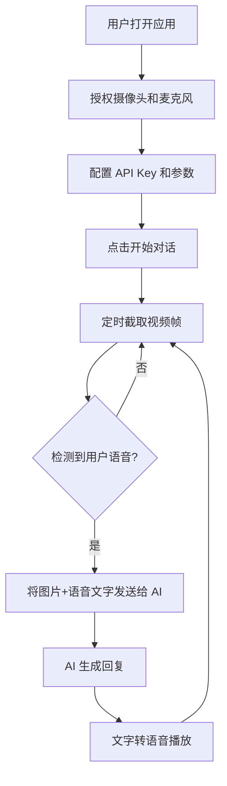

# AI 视觉对话助手 - 产品需求文档

## 1. 产品概述

AI 视觉对话助手是一款基于浏览器的实时多模态交互应用。用户通过摄像头和麦克风与 AI 进行自然对话，AI 能够同时理解视觉画面和语音内容，并给出语音+文字的回应。

目标用户：希望获得沉浸式 AI 交互体验的个人用户，适用于智能陪伴、实时问答、视觉辅助等场景。

## 2. 核心功能

### 2.1 用户角色
| 角色 | 注册方式 | 核心权限 |
|------|----------|----------|
| 普通用户 | 无需注册，打开即用 | 使用全部功能，需自行配置 API Key |

### 2.2 功能模块
1. **主界面**：视频预览区、对话历史、状态控制栏
2. **设置面板**：API Key 配置、模型选择、语音设置、成本控制参数
3. **对话界面**：实时消息流、AI 语音播放、用户语音输入

### 2.3 页面详情
| 页面名称 | 模块名称 | 功能描述 |
|----------|----------|----------|
| 主界面 | 视频预览区 | 实时显示摄像头画面，支持画中画模式 |
| 主界面 | 对话历史区 | 滚动显示用户与 AI 的文字对话记录 |
| 主界面 | 控制栏 | 开启/关闭摄像头、麦克风、AI 对话按钮 |
| 主界面 | 状态指示器 | 显示当前连接状态、语音识别状态、AI 思考状态 |
| 设置面板 | API 配置 | 输入 OpenAI/通义千问等 API Key |
| 设置面板 | 模型选择 | 选择视觉理解模型（GPT-4o / Qwen-VL 等） |
| 设置面板 | 语音设置 | 选择语音合成声音、语速 |
| 设置面板 | 成本控制 | 调整截图频率、画面质量、最大对话轮数 |

## 3. 核心流程

用户打开应用 → 授权摄像头和麦克风 → 配置 API Key → 点击开始对话 → 应用定时截取视频帧 → 检测到用户语音输入 → 将【图片+语音文字】发送给 AI → AI 返回文字回复 → 文字转语音播放 → 循环继续

## 4. 用户界面设计

### 4.1 设计风格
- **主题**：深色科技风（Dark Tech），营造沉浸式未来感
- **主色**：深空黑 `#0a0a0f`、霓虹青 `#00f0ff`、电光紫 `#a855f7`
- **按钮**：悬浮发光效果，圆角 12px，带微动效
- **字体**：标题使用 `Orbitron`（科幻感），正文使用 `Noto Sans SC`
- **布局**：左侧视频区（60%），右侧对话区（40%），响应式折叠
- **图标**：线性图标，带呼吸灯效果

### 4.2 页面设计概述
| 页面名称 | 模块名称 | UI 元素 |
|----------|----------|---------|
| 主界面 | 视频预览区 | 圆角视频框，四角装饰线，录制红点指示器 |
| 主界面 | 对话历史区 | 气泡消息，用户右对齐（青色），AI 左对齐（紫色），带头像 |
| 主界面 | 控制栏 | 底部悬浮玻璃面板，圆形按钮带发光边框 |
| 主界面 | 状态指示器 | 顶部 pill 形状标签，动态脉冲动画 |
| 设置面板 | 抽屉式面板 | 右侧滑出，毛玻璃背景，分组表单 |

### 4.3 响应式设计
- **桌面端**：左右分栏，视频区与对话区并排
- **移动端**：上下堆叠，视频区占 40% 高度，对话区占 60%
- **平板**：中间态，可折叠侧边栏

## 5. 用户故事

### 计划实现的用户故事
1. 作为用户，我希望能一键开启摄像头和麦克风，让 AI 能看到我、听到我
2. 作为用户，我希望 AI 能实时理解我摄像头中的画面内容并做出相关回应
3. 作为用户，我希望可以用语音与 AI 对话，而不是只能打字
4. 作为用户，我希望 AI 的回复也能通过语音播放出来，实现真正的语音对话
5. 作为用户，我希望可以自定义 AI 的语音音色和语速
6. 作为用户，我希望在不使用的时候能方便地关闭摄像头和麦克风，保护隐私
7. 作为用户，我希望应用能告诉我当前的状态（是否在听、是否在思考）
8. 作为用户，我希望控制 AI 调用的成本，避免意外高额费用

## 6. 成本控制策略

### 计划采用的策略
1. **帧率节流**：每 3 秒截取一帧，而非实时视频流推送
2. **分辨率压缩**：截图压缩至 512x512，减少 Token 消耗
3. **语音活动检测 (VAD)**：仅在用户说话时触发 AI 请求，避免无效调用
4. **对话轮数限制**：默认最多保留 10 轮上下文，防止上下文过长
5. **本地画面变化检测**：对比相邻帧差异，画面静止时不重复发送
6. **用户确认机制**：首次使用前明确告知预估成本
