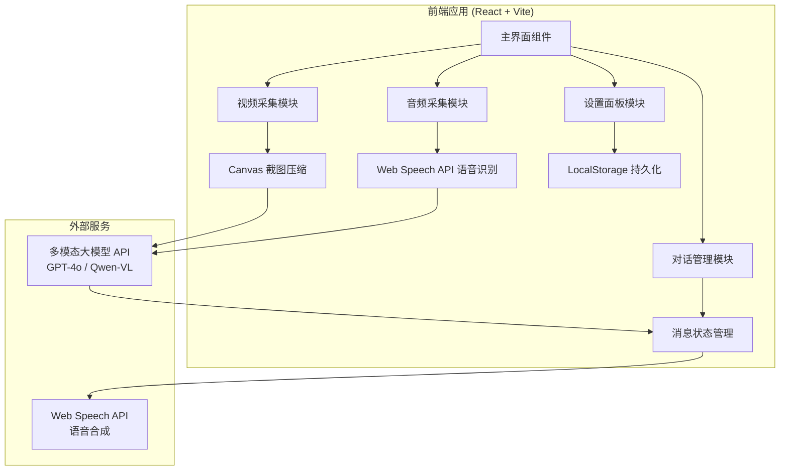

# AI 视觉对话助手 - 技术架构文档

## 1. 架构设计



## 2. 技术选型

- **前端框架**：React 18 + TypeScript
- **构建工具**：Vite 5
- **样式方案**：Tailwind CSS 3 + 自定义 CSS 变量
- **状态管理**：React Context + useReducer（轻量级，无需 Redux）
- **语音合成**：Web Speech API（浏览器原生，免费）
- **语音识别**：Web Speech API（浏览器原生，免费）
- **视频处理**：原生 Canvas API（截图、压缩）
- **HTTP 请求**：原生 fetch（无需 axios，减少依赖）
- **图标**：Lucide React

## 3. 路由定义

| 路由 | 用途 |
|------|------|
| / | 主界面，包含所有功能 |

单页应用，所有功能集成在一个页面，通过状态切换显示设置面板。

## 4. API 定义

### 4.1 多模态模型请求（以 OpenAI GPT-4o 为例）

```typescript
interface ChatCompletionRequest {
  model: string;           // "gpt-4o"
  messages: Array<{
    role: "user" | "assistant" | "system";
    content: string | Array<{
      type: "text" | "image_url";
      text?: string;
      image_url?: { url: string; detail: "low" | "high" | "auto" };
    }>;
  }>;
  max_tokens?: number;
  temperature?: number;
}

interface ChatCompletionResponse {
  id: string;
  choices: Array<{
    message: {
      role: string;
      content: string;
    };
  }>;
  usage: {
    prompt_tokens: number;
    completion_tokens: number;
    total_tokens: number;
  };
}
```

### 4.2 图片压缩服务（前端 Canvas 实现）

```typescript
interface ImageCompressionOptions {
  maxWidth: number;      // 512
  maxHeight: number;     // 512
  quality: number;       // 0.8
  type: string;          // "image/jpeg"
}
```

## 5. 核心模块设计

### 5.1 视频采集模块 (VideoCapture)
- 使用 `navigator.mediaDevices.getUserMedia({ video: true })`
- 定时器每 3 秒执行 `canvas.drawImage()` + `canvas.toDataURL()`
- 返回 base64 编码的压缩图片

### 5.2 音频采集模块 (AudioCapture)
- 使用 `navigator.mediaDevices.getUserMedia({ audio: true })`
- 使用 Web Speech API `SpeechRecognition` 进行实时语音识别
- 识别结果触发 AI 请求

### 5.3 对话管理模块 (ChatManager)
- 维护消息数组状态
- 管理对话上下文（最多 10 轮）
- 处理 AI 请求和响应
- 调用语音合成播放回复

### 5.4 成本控制模块 (CostControl)
- 帧率控制：可配置截图间隔（1-10 秒）
- 分辨率控制：可配置压缩尺寸（256-1024）
- 画面变化检测：对比相邻帧的像素差异
- Token 估算：根据图片尺寸和文字长度预估

## 6. 数据模型

### 6.1 消息结构

```typescript
interface Message {
  id: string;
  role: "user" | "assistant" | "system";
  content: string;
  imageUrl?: string;       // 用户消息附带的截图
  timestamp: number;
  tokens?: number;         // 该消息消耗的 Token 数
}
```

### 6.2 应用配置

```typescript
interface AppConfig {
  apiKey: string;
  apiBase: string;         // API 代理地址
  model: string;           // 模型名称
  voice: string;           // 语音合成声音
  voiceRate: number;       // 语速 0.5-2.0
  captureInterval: number; // 截图间隔（秒）
  maxImageSize: number;    // 最大图片尺寸
  maxContextRounds: number;// 最大上下文轮数
  enableVAD: boolean;      // 是否启用语音活动检测
}
```

## 7. 性能优化

- **图片压缩**：在发送前使用 Canvas 将图片压缩至 512x512，格式转为 JPEG
- **防抖处理**：语音识别结果防抖 500ms，避免频繁触发
- **懒加载**：对话历史虚拟滚动，避免大量 DOM 节点
- **资源释放**：组件卸载时停止所有媒体流，释放摄像头和麦克风
